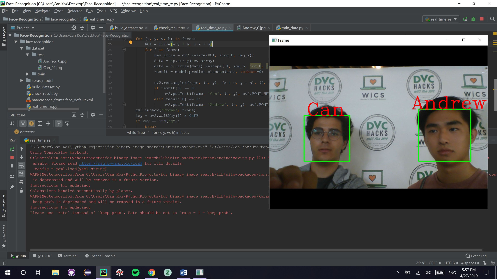
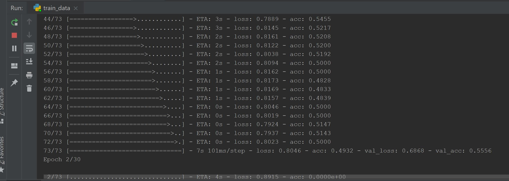
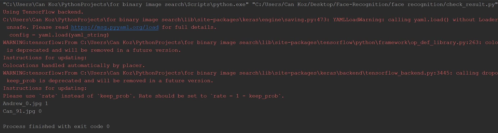

# Multiple-Face-Recognition

Multipe Face Recognition program that uses Keras and OpenCV. I built this as a part of DVCHacks.

## build_dataset.py

Taking pictures of the user by using OpenCV. Saving those pictures in a folder named "dataset". By the use of haarcascade features the pictures only include human faces.

## train_data.py

I created a convolutional feature extractor network with multiple layers. I did that in order to genereate a representation vector of the input images which will make use of "dataset". 
- Softmax is used in this project as a last layer. output activation function. 
- The training is done by the use of the Adam optimizer function. 
- The learning rate of the Adam optimizer is 3e-4. 
- As a loss function I used binary crossentropy, the reason why I preferred binary crossentopy is becasue there were two classes. 
- For future work if you want to add more classes you may use categorical crossentropy function. 
- The validation set is chosen as 10% of the training set.
- The traninig of my model is complteted within 30 epochs. 
- Validation accuracy, validation loss of the model is printed at the end of the training process. 
- At last weights are saved as a ".h5" file and model structure is saved as a ".yaml" file and both of them are kept in "keras_model" folder.  

## check_result.py

The test accuracy can be seen from the results of this file. In this file, I crate labels for the test set.

## real_time_re.py

Real time test of the model from the webcam of your setup.

References
- [Keras](https://keras.io/)
- [OpenCV](https://opencv.org/)
- [TensorFlow](https://www.tensorflow.org/)
